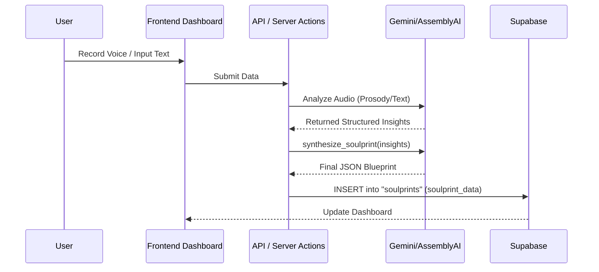

# SoulPrint Platform - Technical Onboarding Guide

## 1. README / Instruction Files Summary

The project contains a `README.md` file that provides a high-level overview of the **SoulPrint Landing Page** and application. This document serves as the primary entry point for understanding the project's purpose and setup.

### Project Overview
**SoulPrint** is an AI-powered platform designed for "cognitive analysis and identity mapping." The current codebase includes a modern, responsive landing page and a core application built with **Next.js 15+** (App Router), **TypeScript**, and **Tailwind CSS**. It features a dark/light mode, smooth animations, and a dashboard for user interaction.

### Local Setup & Execution
The project uses `npm` for dependency management.
- **Install Dependencies**: `npm install`
- **Run Development Server**: `npm run dev` (Starts at `http://localhost:3000`)
- **Clean Start**: `npm run dev:clean` (custom script)
- **Production Build**: `npm run build` followed by `npm start`

### Contribution & Standards
- **Linting**: Standard ESLint configuration (`npm run lint`).
- **Styling**: Utility-first CSS using **Tailwind CSS**.
- **UI Components**: Built with **shadcn/ui** and **Radix UI** primitives.
- **Conventions**: The project follows the Next.js App Router structure (`app/` directory) and strictly uses TypeScript.

---

## 2. Detailed Technology Stack

### Core Frameworks & Languages
- **Language**: **TypeScript 5** ([`package.json`](package.json))
- **Frontend Framework**: **Next.js 16.0.7** (App Router)
- **UI Library**: **React 19.2.0**
- **Styling**: 
  - **Tailwind CSS 3.4**
  - **Radix UI** primitives (Accordion, Dialog, Slot, etc.)
  - **Framer Motion** (for animations)
  - **Lucide React** (Icons)

### Backend & Database
- **Backend Environment**: Next.js Server Actions / API Routes
- **Database**: **Supabase** (PostgreSQL)
  - Configured in `supabase/` and [`lib/soulprint/db.ts`](lib/soulprint/db.ts)
  - Uses `pgvector` likely for AI embeddings (implied by AI nature, though not explicitly seen in schema file).
- **ORM/Query Builder**: `@supabase/supabase-js`, `@supabase/ssr`

### AI & Machine Learning
- **LLM Integration**: 
  - **Google Gemini** (`@google/genai`)
  - **OpenAI** (folder in `lib/openai`)
  - **Letta** (folder in `lib/letta`) - Likely for advanced memory/persona management.
- **Voice/Audio Analysis**:
  - **AssemblyAI** (`assemblyai`) - For transcription/intelligence.
  - **Meyda** - Audio feature extraction.
  - **Pitchy** - Pitch detection.
  - **Hark** - Speech detection.
  - **AWS SageMaker** - Listed in `package.json` (`@aws-sdk/client-sagemaker`), potentially for custom model inference.

### Integrations & Tools
- **CRM**: **Streak** (via [`lib/streak.ts`](lib/streak.ts)) - For managing waitlists/leads.
- **Automation**: **n8n** - Webhook endpoints configured in `.env`.
- **Email**: **Nodemailer** - For sending emails.
- **Design/Graphics**: **Three.js** / **React Three Fiber** (for 3D visualizations).

---

## 3. System Overview and Purpose

### Purpose
The **SoulPrint** system is designed to create a "digital map" of a user's cognition and identity. It solves the problem of understanding human behavior and personality depth by analyzing multiple data points (voice, text responses) to generate a unique "SoulPrint."

### Core Functionalities
1.  **Identity Mapping**: analyzing user inputs to create a structured profile (`soulprints` table).
2.  **Voice Analysis**: capturing and analyzing prosody, pitch, and tone to infer emotional state or personality traits.
3.  **Interactive Dashboard**: A user-facing portal (`/dashboard`) for users to view their profile, chat with an AI persona, and manage their settings.
4.  **Waitlist/Onboarding**: A marketing funnel that captures leads and pushes them to a CRM (Streak).

---

## 4. Project Structure and Reading Recommendations

### Entry Points
-   **Main Landing Page**: [`app/page.tsx`](app/page.tsx)
-   **Root Layout**: [`app/layout.tsx`](app/layout.tsx) - Defines the global shell, fonts, and theme providers.
-   **Dashboard Entry**: [`app/dashboard/page.tsx`](app/dashboard/page.tsx) - The main authenticated view.

### General Organization
-   `app/` - Next.js App Router pages and API routes.
    -   `api/` - Backend endpoints (e.g., for webhooks or proxying requests).
    -   `dashboard/` - Authenticated user area.
-   `components/` - React components.
    -   `ui/` - Reusable primitives (buttons, cards).
    -   `sections/` - Major page sections (Hero, Features).
-   `lib/` - Shared business logic and integrations.
    -   `soulprint/` - Core domain logic for generating prints and analyzing voice.
    -   `supabase/` - Database clients.
-   `supabase/` - Database migrations and schema definitions.

### Configuration Files
-   **Environment Variables**: `.env` / `.env.local` (See [`.env.example`](.env.example))
-   **Tailwind**: [`tailwind.config.ts`](tailwind.config.ts)
-   **TypeScript**: [`tsconfig.json`](tsconfig.json)
-   **Database Schema**: [`supabase/schema.sql`](supabase/schema.sql)

### Reading Recommendation
1.  Start with **[`app/page.tsx`](app/page.tsx)** and **[`components/sections/hero.tsx`](components/sections/hero.tsx)** to see the visual setup.
2.  Read **[`lib/soulprint/generator.ts`](lib/soulprint/generator.ts)** to understand how the core product value is created.
3.  Review **[`supabase/schema.sql`](supabase/schema.sql)** to understand the data model.
4.  Explore **[`app/dashboard/`](app/dashboard/)** to see the application state.

---

## 5. Key Components

### 1. SoulPrint Generator
**Location**: [`lib/soulprint/generator.ts`](lib/soulprint/generator.ts)
**Responsibility**: Logic for compiling user data into a "SoulPrint." likely Orchestrates calls to AI services to synthesize the profile.

### 2. Voice Analyzer
**Location**: [`lib/soulprint/voice-analyzer.ts`](lib/soulprint/voice-analyzer.ts) (and `v2`, `assemblyai-analyzer.ts`)
**Responsibility**: Handles audio processing. It integrates with AssemblyAI and local libraries (Meyda, Pitchy) to extract prosodic features from user speech.

### 3. Dashboard Layout
**Location**: [`app/dashboard/layout.tsx`](app/dashboard/layout.tsx)
**Responsibility**: Manages the authenticated shell, sidebar navigation, and user session context for the application.

---

## 6. Execution and Data Flows

### 1. User Onboarding & Profile Creation
1.  **Signup**: User signs up via Supabase Auth (`app/signup`).
2.  **Trigger**: `handle_new_user` function in [`supabase/schema.sql`](supabase/schema.sql) automatically inserts a row into the `public.profiles` table using data from `auth.users`.
3.  **Waitlist**: If using the waitlist form, data is posted to the backend and synced to **Streak** CRM via [`lib/streak.ts`](lib/streak.ts).

### 2. SoulPrint Generation Flow
1.  **Input**: User creates a new entry (text or voice) in the Dashboard.
2.  **Processing**:
    -   If Voice: Audio is processed via `VoiceAnalyzer`.
    -   Content is sent to the AI Engine (Gemini/OpenAI) via `lib/gemini` or `lib/openai`.
3.  **Persistence**: The resulting structured data is stored in the `soulprints` table in the `soulprint_data` JSONB column.
4.  **Usage**: The system consumes `proxy_usage` tokens for accountability.

### 6.1 Database Schema Overview
-   **`profiles`**: User identity (Full Name, Avatar).
-   **`soulprints`**: Stores the core dynamic document. The `soulprint_data` column is `JSONB`, allowing flexible schema evolution for the AI-generated profiles.
-   **`api_keys`**: Manages user API keys for external access.
-   **`proxy_usage`**: Tracks token consumption for billing/limits.

---

## 7. Dependencies and Integrations

### Dependencies
-   **`@supabase/supabase-js`**: Core DB client. [Configured in `lib/supabase/`](lib/supabase/)
-   **`framer-motion`**: Used extensively for UI animations.
-   **`three` / `@react-three/fiber`**: Used for 3D visualizations (likely the "SoulPrint" visual representation).

### Integrations
-   **Google Gemini**: Primary LLM for cognitive analysis. Configured via `GEMINI_API_KEY`.
-   **AssemblyAI**: Third-party API for speech-to-text and audio intelligence.
-   **Streak CRM**: Integration for managing early access/leads. See [`lib/streak.ts`](lib/streak.ts).
-   **n8n**: Webhooks used for "SoulPrint Submission" automation. Configured via `NEXT_PUBLIC_N8N_SOULPRINT_WEBHOOK`.

---

## 8. Diagrams

### System Architecture

```mermaid
graph TD
    User[Web Client] --> Next[Next.js App Server]
    User --> Supa[Supabase Auth/DB]
    
    Next --> Supa
    Next --> Gemini[Google Gemini API]
    Next --> Assembly[AssemblyAI]
    Next --> Streak[Streak CRM]
    Next --> n8n[n8n Automation]
    
    subgraph Data Layer
        Supa --> Profiles[Profiles Table]
        Supa --> Soul[SoulPrints Table (JSONB)]
    end
    
    subgraph AI Logic
        Gemini --> Analysis[Cognitive Analysis]
        Assembly --> Voice[Voice/Prosody Analysis]
    end
```

### SoulPrint Data Flow



---

## 9. Testing
**Status**: **No automated testing framework is currently configured.**
-   There are no `test` scripts in `package.json`.
-   No `__tests__` directories or `.test.ts` / `.spec.ts` files were observed in the root or main directories.
-   Testing appears to be manual or ad-hoc.

**Recommendation**: Initialize Jest or Vitest for unit testing `lib/soulprint` logic and Playwright/Cypress for E2E flows.

---

## 10. Error Handling and Logging
-   **Logging**: Primarily uses standard `console.log` / `console.error` during development. There is no evidence of a centralized logging service (like Sentry or LogRocket) in the dependency list.
-   **Error Handling**: Next.js `error.tsx` boundaries are likely used in the App Router (standard practice), though specific custom implementations were not deeply audited.

---

## 11. Security Considerations
-   **Authentication**: Handled entirely by **Supabase Auth**.
-   **Authorization (RLS)**: Row Level Security is **enabled and strictly configured** in [`supabase/schema.sql`](supabase/schema.sql). Users can only view/edit their own data.
    -   Example: `CREATE POLICY "Users can view their own soulprints" ON public.soulprints ... USING (auth.uid() = user_id);`
-   **Environment Variables**: Sensitive keys (Supabase Admin, Gemini Key, Webhook Secrets) are stored in `.env` files and should **never** be committed.

---

## 12. Other Relevant Observations
-   **Build/Deploy**:
    -   The project is "ready to deploy" to **Vercel** or **Netlify**.
    -   Review `next.config.ts` for specific build optimizations.
-   **Scripts**:
    -   `seed:demo`: A script (`seed-demo.js`) exists to populate the database with dummy data, useful for rapid development.
    -   `dev:clean`: A utility to likely clear caches or temp files before starting dev.
-   **Mobile Responsiveness**: The README emphasizes "Desktop-first design that adapts to all screen sizes," but ensure to test complex 3D components on mobile devices.
