# SoulPrint Architecture Diagram

```mermaid
flowchart TD
    %% External Users
    User("👤 User"):::external

    %% Frontend Layer
    subgraph "Frontend Layer"
        Landing["🏠 Landing Page"]:::frontend
        Signup["📝 Signup"]:::frontend
        Login["🔐 Login"]:::frontend
        Import["📥 Import"]:::frontend
        Chat["💬 Chat"]:::frontend
        Dashboard["📊 Dashboard"]:::frontend
        Achievements["🏆 Achievements"]:::frontend
        Memory["🧠 Memory View"]:::frontend
        Pillars["🎯 Pillars"]:::frontend
        Voice["🎤 Voice"]:::frontend
        Admin["👑 Admin"]:::frontend
    end

    %% Components Layer
    subgraph "Components"
        subgraph "Auth Components"
            LoginForm["Login Form"]:::component
            SignupModal["Signup Modal"]:::component
            AuthModal["Auth Modal"]:::component
        end
        
        subgraph "Chat Components"
            ChatInput["Chat Input"]:::component
            ChatMessage["Chat Message"]:::component
            TelegramChat["Telegram Chat UI"]:::component
            GlassmorphicChat["Glassmorphic Chat"]:::component
        end
        
        subgraph "UI Components"
            Navbar["Navbar"]:::component
            Hero["Hero Section"]:::component
            Features["Features Bento"]:::component
            Footer["Footer"]:::component
            Stepper["Stepper"]:::component
            Toast["Toast"]:::component
        end
    end

    %% API Layer
    subgraph "API Routes"
        subgraph "Auth API"
            AuthSignout["/api/auth/signout"]:::api
            AuthCallback["/api/auth/callback"]:::api
        end
        
        subgraph "Import API"
            ImportProcess["/api/import/process-server"]:::api
            ImportComplete["/api/import/complete"]:::api
            ImportStatus["/api/import/motia/status"]:::api
        end
        
        subgraph "Chat API"
            ChatRoute["/api/chat"]:::api
        end
        
        subgraph "Memory API"
            MemoryQuery["/api/memory/query"]:::api
            MemoryList["/api/memory/list"]:::api
            MemorySynthesize["/api/memory/synthesize"]:::api
        end
        
        subgraph "Profile API"
            ProfileAIName["/api/profile/ai-name"]:::api
            ProfileAvatar["/api/profile/ai-avatar"]:::api
        end
        
        subgraph "Gamification API"
            GamificationStats["/api/gamification/stats"]:::api
            GamificationXP["/api/gamification/xp"]:::api
            GamificationAchievements["/api/gamification/achievements"]:::api
        end
        
        subgraph "Other APIs"
            SoulprintAPI["/api/soulprint"]:::api
            EmbeddingsAPI["/api/embeddings"]:::api
            VoiceAPI["/api/voice"]:::api
            TranscribeAPI["/api/transcribe"]:::api
            WaitlistAPI["/api/waitlist"]:::api
            PushAPI["/api/push"]:::api
            TasksAPI["/api/tasks"]:::api
            RLMAPI["/api/rlm"]:::api
        end
    end

    %% Library Layer
    subgraph "Core Libraries"
        subgraph "Database"
            SupabaseClient["Supabase Client"]:::lib
            SupabaseServer["Supabase Server"]:::lib
            SupabaseMiddleware["Supabase Middleware"]:::lib
        end
        
        subgraph "Memory System"
            MemoryQuery2["Memory Query"]:::lib
            MemoryFacts["Facts Extraction"]:::lib
            MemoryLearning["Learning Engine"]:::lib
        end
        
        subgraph "AI/ML"
            BedrockClient["Bedrock Client"]:::lib
            RLMHealth["RLM Health"]:::lib
            Mem0Client["Mem0 Client"]:::lib
            ChatGPTParser["ChatGPT Parser"]:::lib
        end
        
        subgraph "Search"
            SmartSearch["Smart Search"]:::lib
            Perplexity["Perplexity"]:::lib
            Tavily["Tavily"]:::lib
        end
        
        subgraph "Utilities"
            ErrorHandler["Error Handler"]:::lib
            TTLCache["TTL Cache"]:::lib
            RateLimit["Rate Limiter"]:::lib
            Retry["Retry Logic"]:::lib
            CSRF["CSRF Protection"]:::lib
        end
        
        subgraph "SoulPrint"
            SoulprintCore["SoulPrint Core"]:::lib
            SoulprintTypes["SoulPrint Types"]:::lib
        end
        
        subgraph "Other Libs"
            ChunkedUpload["Chunked Upload"]:::lib
            EmailSend["Email Sender"]:::lib
            GamificationXPLib["XP Calculator"]:::lib
            BranchManager["Branch Manager"]:::lib
        end
    end

    %% External Services
    subgraph "External Services"
        Supabase[("🗄️ Supabase")]:::external_service
        RLMService["🤖 RLM Service<br/>(Render)"]:::external_service
        Bedrock["☁️ AWS Bedrock<br/>(Claude + Embeddings)"]:::external_service
        Cloudinary["📸 Cloudinary"]:::external_service
        Resend["📧 Resend"]:::external_service
        Vercel["🚀 Vercel"]:::external_service
    end

    %% Database Tables
    subgraph "Supabase Database"
        UserProfiles[("user_profiles")]:::database
        ConvoChunks[("conversation_chunks")]:::database
        ChatMessages[("chat_messages")]:::database
        LearnedFacts[("learned_facts")]:::database
        Referrals[("referral_tracking")]:::database
        RecurringTasks[("recurring_tasks")]:::database
        SoulprintFiles[("soulprint_files")]:::database
    end

    %% Connections - User Flow
    User -->|"visits"| Landing
    Landing -->|"auth"| Signup
    Landing -->|"auth"| Login
    Signup -->|"imports"| Import
    Login -->|"continues"| Chat
    Import -->|"processes"| Chat
    Chat -->|"views"| Memory
    Chat -->|"earns"| Achievements
    Chat -->|"configures"| Dashboard

    %% Page to Component connections
    Signup --> SignupModal
    Login --> LoginForm
    Chat --> ChatInput
    Chat --> ChatMessage
    Chat --> TelegramChat
    Landing --> Hero
    Landing --> Features
    Landing --> Navbar

    %% API connections
    LoginForm -->|"POST"| AuthCallback
    SignupModal -->|"POST"| AuthCallback
    Import -->|"POST"| ImportProcess
    ChatInput -->|"POST"| ChatRoute
    Memory -->|"GET"| MemoryQuery
    Dashboard -->|"GET"| GamificationStats
    Achievements -->|"GET"| GamificationAchievements

    %% API to Library connections
    ChatRoute --> MemoryQuery2
    ChatRoute --> BedrockClient
    ImportProcess --> ChatGPTParser
    ImportProcess --> SoulprintCore
    MemoryQuery --> SmartSearch
    GamificationXP --> GamificationXPLib

    %% Library to External Service connections
    SupabaseClient -->|"queries"| Supabase
    BedrockClient -->|"inference"| Bedrock
    RLMHealth -->|"health check"| RLMService
    EmailSend -->|"sends"| Resend
    ChunkedUpload -->|"uploads"| Cloudinary

    %% RLM Service connections
    RLMService -->|"embeddings"| Bedrock
    RLMService -->|"soulprint gen"| Bedrock

    %% Database connections
    Supabase --> UserProfiles
    Supabase --> ConvoChunks
    Supabase --> ChatMessages
    Supabase --> LearnedFacts
    Supabase --> Referrals
    Supabase --> RecurringTasks
    Supabase --> SoulprintFiles

    %% Click Events
    click Landing "app/page.tsx"
    click Signup "app/signup/page.tsx"
    click Login "app/login/page.tsx"
    click Import "app/import/page.tsx"
    click Chat "app/chat/page.tsx"
    click Dashboard "app/dashboard/page.tsx"
    click Achievements "app/achievements/page.tsx"
    click Memory "app/memory/page.tsx"
    click Pillars "app/pillars/page.tsx"
    click Voice "app/voice/page.tsx"
    click Admin "app/admin/page.tsx"
    
    click LoginForm "components/auth/login-form.tsx"
    click SignupModal "components/auth/signup-modal.tsx"
    click AuthModal "components/auth-modal.tsx"
    click ChatInput "components/chat/ChatInput.tsx"
    click ChatMessage "components/chat/ChatMessage.tsx"
    click TelegramChat "components/chat/telegram-chat-v2.tsx"
    click GlassmorphicChat "components/chat-variants/GlassmorphicChat.tsx"
    click Navbar "components/Navbar.tsx"
    click Hero "components/sections/hero.tsx"
    click Features "components/sections/features-bento.tsx"
    click Footer "components/sections/footer.tsx"
    
    click AuthSignout "app/api/auth/signout"
    click AuthCallback "app/auth/callback"
    click ImportProcess "app/api/import"
    click ChatRoute "app/api/chat"
    click MemoryQuery "app/api/memory"
    click ProfileAIName "app/api/profile"
    click GamificationStats "app/api/gamification"
    click SoulprintAPI "app/api/soulprint"
    click EmbeddingsAPI "app/api/embeddings"
    click VoiceAPI "app/api/voice"
    click TranscribeAPI "app/api/transcribe"
    click WaitlistAPI "app/api/waitlist"
    click RLMAPI "app/api/rlm"
    
    click SupabaseClient "lib/supabase/client.ts"
    click SupabaseServer "lib/supabase/server.ts"
    click SupabaseMiddleware "lib/supabase/middleware.ts"
    click MemoryQuery2 "lib/memory/query.ts"
    click MemoryFacts "lib/memory/facts.ts"
    click MemoryLearning "lib/memory/learning.ts"
    click BedrockClient "lib/bedrock.ts"
    click RLMHealth "lib/rlm/health.ts"
    click Mem0Client "lib/mem0/client.ts"
    click ChatGPTParser "lib/mem0/chatgpt-parser.ts"
    click SmartSearch "lib/search/smart-search.ts"
    click Perplexity "lib/search/perplexity.ts"
    click Tavily "lib/search/tavily.ts"
    click ErrorHandler "lib/api/error-handler.ts"
    click TTLCache "lib/api/ttl-cache.ts"
    click RateLimit "lib/rate-limit.ts"
    click Retry "lib/retry.ts"
    click CSRF "lib/csrf.ts"
    click SoulprintCore "lib/soulprint/index.ts"
    click SoulprintTypes "lib/soulprint/types.ts"
    click ChunkedUpload "lib/chunked-upload.ts"
    click EmailSend "lib/email/send.ts"
    click GamificationXPLib "lib/gamification/xp.ts"
    click BranchManager "lib/versioning/branch-manager.ts"

    %% Styles
    classDef external fill:#f9f,stroke:#333,stroke-width:2px
    classDef frontend fill:#61dafb,stroke:#333,stroke-width:1px,color:#000
    classDef component fill:#a8e6cf,stroke:#333,stroke-width:1px,color:#000
    classDef api fill:#ffd93d,stroke:#333,stroke-width:1px,color:#000
    classDef lib fill:#c9b1ff,stroke:#333,stroke-width:1px,color:#000
    classDef external_service fill:#ff6b6b,stroke:#333,stroke-width:2px,color:#fff
    classDef database fill:#4ecdc4,stroke:#333,stroke-width:1px,color:#000
```

## Legend

| Color | Component Type |
|-------|----------------|
| 🔵 Cyan | Frontend Pages |
| 🟢 Green | UI Components |
| 🟡 Yellow | API Routes |
| 🟣 Purple | Core Libraries |
| 🔴 Red | External Services |
| 🩵 Teal | Database Tables |

## Interactive Features

Click on any component to navigate to its source file in the repository.
